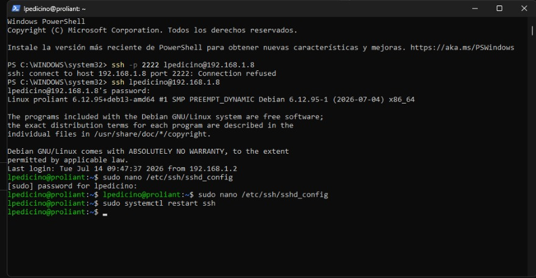

# Infrastructure Laboratory: On-Premise ProLiant & Containerization

This repository documents the end-to-end provisioning of a physical HP ProLiant server. The objective was to build a robust, manageable on-premise development environment, transitioning from bare-metal installation to containerized service orchestration.

## 🚀 Implementation Workflow

1. **Physical Provisioning**: Hardware setup, including peripheral integration and stable Ethernet network cabling.
2. **Operating System Deployment**: Clean installation of **Debian 13 (Bookworm)** via bootable USB media.
3. **Environment Hardening**: Initial system configuration, including root/user privilege management and static IP addressing for network stability.
4. **Remote Administration (SSH)**: Deployment and hardening of the OpenSSH server to enable secure, remote administration from a Windows-based primary workstation using PowerShell.
5. **Tooling and Dependencies**:
    * System repository synchronization and kernel package upgrades via `apt`.
    * Deployment of monitoring utilities (`htop`) for real-time performance tracking.
    * Installation and configuration of the **Docker Engine** (CE).
6. **Network and Service Orchestration**:
    * System-level DNS configuration.
    * Deployment and isolation of an **Nginx** web server container, mapped to port 80.
7. **Connectivity Validation**: Successful service resolution and load testing via local browser interface.

## 🛠️ Technical Stack

* **Hardware**: HP ProLiant Server
* **OS**: Debian 13
* **Container Runtime**: Docker
* **Web Server**: Nginx
* **Remote Management**: SSH / PowerShell

## 📸 Technical Evidence

*Figure 1: Remote administrative session from PowerShell to the ProLiant host, demonstrating configuration debugging in `/etc/ssh/sshd_config` and service restart workflows.*

---

## ⚙️ Operational Notes & Troubleshooting

### Incident: SSH Connectivity (`Connection Refused`)
During the initial provisioning phase, connectivity attempts on port 2222 resulted in a `Connection refused` error.

* **Root Cause Analysis**: Misalignment between the client-side connection request and the SSH daemon's listening port configuration.
* **Resolution**: 
    1. Accessed local host environment.
    2. Modified `/etc/ssh/sshd_config` to standardize listening parameters.
    3. Performed a daemon restart via `systemctl` to apply changes.
    4. Validated connectivity via PowerShell, confirming successful session establishment.

---
*Maintained by: LPedicino*